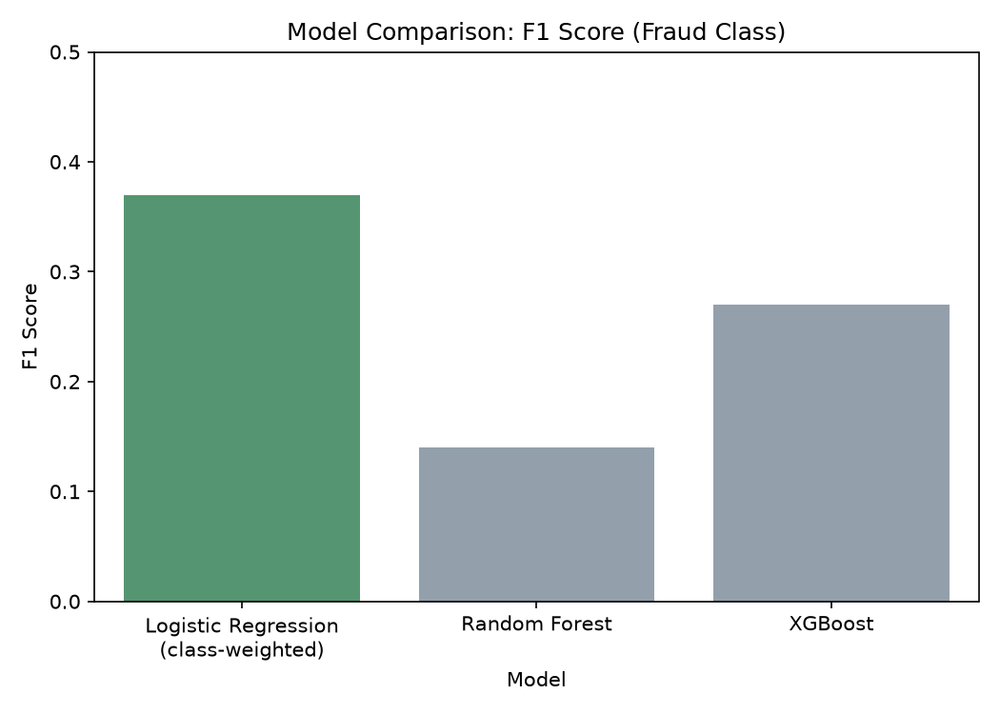
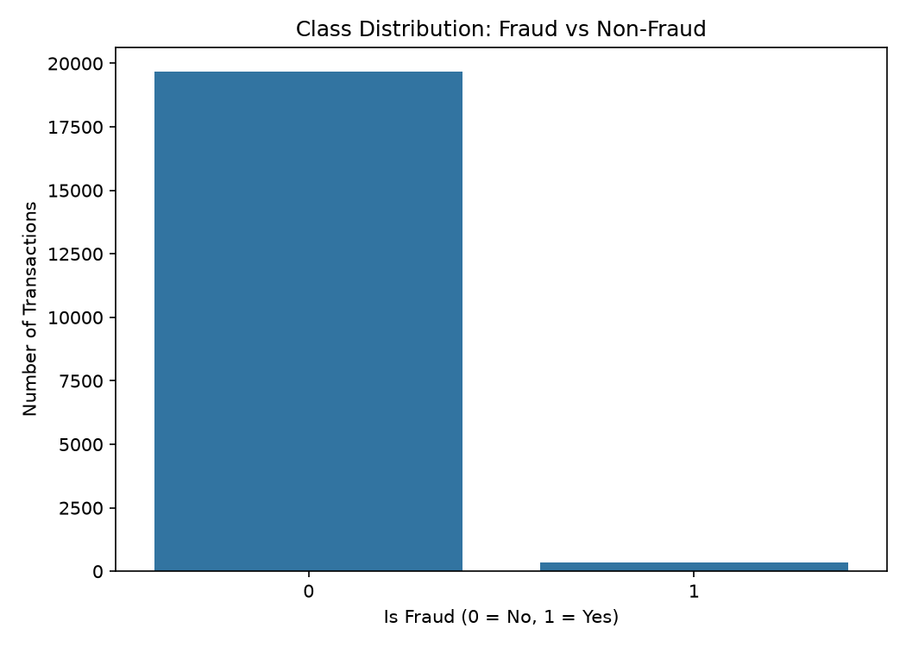
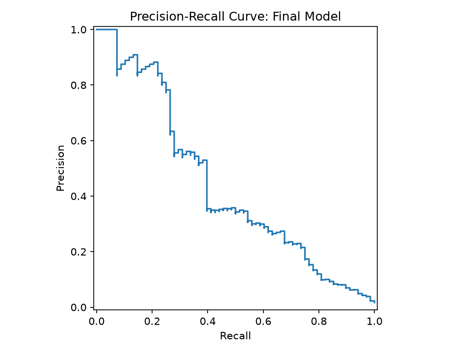
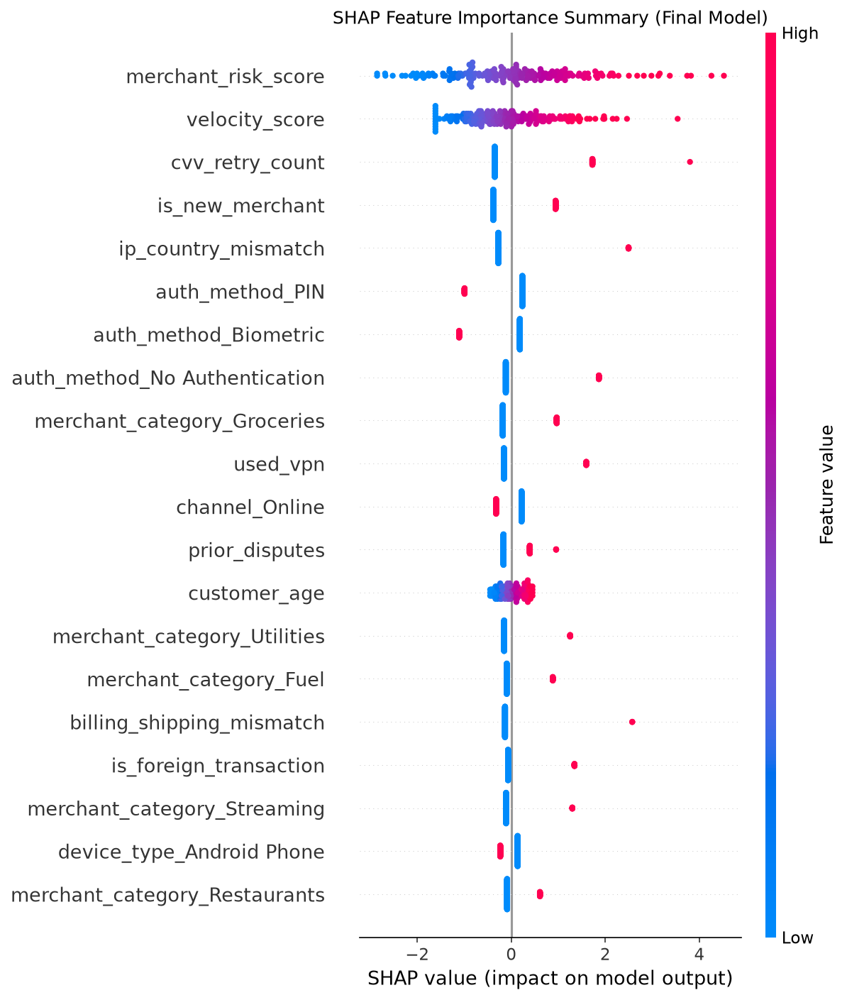

# Fraud Detection System

A machine learning system that detects fraudulent financial transactions, built end-to-end: from raw data through a trained, evaluated model to a deployed, interactive API and demo.

[](https://github.com/ISeckAli/Fraud-detection/actions/workflows/tests.yml)
[](https://opensource.org/licenses/MIT)

**[Live Demo](https://fraud-detection-demo-u8l5.onrender.com)** · **[API Endpoint](https://fraud-detection-api-j3q4.onrender.com)** · **[Model Card](MODEL_CARD.md)**

> **Note:** the API and demo are hosted on Render's free tier, which spins down after periods of inactivity. The first request after idle time may take up to ~50 seconds while the server wakes up.

---

## The Problem

Fraud detection is a textbook example of **imbalanced classification**: fraudulent transactions typically represent a tiny fraction of total volume. This dataset is no exception, at **1.69% fraud**. That imbalance breaks the tools people reach for first, most obviously plain accuracy, and forces a set of deliberate engineering decisions that this project makes explicit and defends with evidence, rather than skipping past.

## Why This Dataset

Most public fraud datasets (including the well-known ULB/Kaggle "Credit Card Fraud Detection" set) anonymize their features via PCA, leaving columns named `V1` through `V28` with no interpretable meaning. That's realistic for a real bank's public release, but it makes genuine feature analysis and explainability impossible.

This project uses **"Credit Card Fraud Detection 2026"** (Udit Jain, Kaggle, CC0 license): 20,000 synthetic transactions with named, interpretable features (`velocity_score`, `cvv_retry_count`, `ip_country_mismatch`, `merchant_risk_score`, and 20 others). This makes it possible to answer *why* a transaction was flagged with a real, specific, defensible sentence, not just a black-box score.

## Results

| Model | Precision | Recall | F1 Score |
|---|---|---|---|
| **Logistic Regression (class-weighted)** — final model | **0.25** | **0.68** | **0.37** |
| Random Forest | 0.30 | 0.09 | 0.14 |
| XGBoost | 0.39 | 0.21 | 0.27 |

The simpler, more interpretable model outperformed both ensemble methods on this dataset. This isn't the "expected" outcome, and the project treats it as a finding to report honestly rather than a result to explain away.



**Why accuracy is the wrong headline metric here:** a dummy classifier that always predicts "not fraud" scores **98.3% accuracy** while catching exactly 0% of fraud. Precision, recall, and F1 on the fraud class are the metrics that actually matter.



### The threshold decision

The default 0.5 probability cutoff is rarely the right business decision on imbalanced data. This project explicitly tunes and justifies its threshold: **0.85**, chosen to prioritize recall. In fraud detection, a missed fraud case (false negative) causes direct financial loss, while a false alarm (false positive) costs a legitimate customer a moment of friction, e.g. an extra verification step. That asymmetry justifies accepting more false positives in exchange for catching substantially more real fraud (68% recall at this threshold, versus 43% at the default 0.5 cutoff).



### Interpretability

SHAP analysis on the final model surfaces the features actually driving predictions, and they align with the domain intuition the dataset's design intended: `merchant_risk_score`, `velocity_score`, and `cvv_retry_count` dominate, exactly the signals a fraud analyst would expect to matter.



## A Real Debugging Story: the SMOTE Bug

Initial SHAP analysis surfaced something wrong: `device_type` dominated feature importance, contradicting the correlation analysis from EDA, which showed device type barely differs between fraud and non-fraud transactions.

Investigation traced this to a genuine data corruption bug: standard SMOTE oversampling was applied *after* one-hot encoding. SMOTE interpolates numerically between data points, but one-hot encoded categorical columns are only ever valid as strict 0 or 1. SMOTE was generating fractional values (confirmed directly: values like `0.00019486` for a column that should only ever be `0` or `1`), which pandas then silently rounded to boolean `True` on cast, systematically inflating rare categories in the synthetic training data.

The fix went through two iterations:
1. **SMOTENC** (SMOTE for mixed Nominal/Continuous data), which respects true category boundaries, fixed the corruption but reduced fraud-class diversity in the synthetic examples (a known tradeoff of its majority-vote category assignment) and hurt real performance (F1 dropped to 0.12).
2. **Class-weighting** (`class_weight="balanced"`) sidesteps synthetic data entirely, letting the model weight the rare class higher during training. This became the final approach: no synthetic data distortion, and the best real, honestly-evaluated performance of any method tried.

This is documented here deliberately: catching a subtle, silent bug in a working-looking pipeline, understanding its actual mechanism, and correcting course based on honest evaluation, rather than the first result that looked good.

## Architecture

data/ Raw dataset (gitignored; see Setup below)
notebooks/01_eda.ipynb Full pipeline: EDA, preprocessing, training,
evaluation, threshold tuning, interpretability
models/ Serialized model, scaler, feature columns, threshold
api/app.py Flask API: /predict endpoint, input validation,
rate limiting, CORS
demo/index.html Interactive demo interface (vanilla HTML/JS)
tests/test_api.py pytest suite: input validation, valid response
shape, correct fraud/non-fraud classification
.github/workflows/ CI: tests run automatically on every push
reports/ Exported chart images used in this README


**Model artifacts are committed directly to this repository.** They're small (~5KB total), so the tradeoff of Git-tracking generated files is a reasonable one here; a production system at real scale would typically use a dedicated model registry or object storage instead.

## API

**POST** `/predict`

Accepts a JSON object describing one transaction (see `demo/index.html` for a complete example payload) and returns:

```json
{
  "fraud_probability": 0.0036,
  "is_fraud": false,
  "threshold_used": 0.85
}
```

Missing or malformed input returns a `400` with a specific, actionable error message rather than a generic failure. The endpoint is rate-limited (10 requests/minute) to protect the free-tier deployment.

## Setup

```bash
git clone https://github.com/ISeckAli/Fraud-detection.git
cd Fraud-detection
python -m venv venv
venv\Scripts\activate          # Windows
pip install -r requirements.txt
```

The raw dataset is not committed (it's gitignored, per standard practice for data files). Download `credit_card_fraud_2026.csv` from [Kaggle](https://www.kaggle.com/datasets/uditjain13/credit-card-fraud-detection-2026) and place it in `data/` to re-run the notebook.

To run the API locally:
```bash
python api/app.py
```

To run the test suite:
```bash
pytest tests/ -v
```

## Limitations

- **Dataset scale**: 20,000 transactions is small relative to enterprise fraud volumes; real-world class imbalance can be far more extreme.
- **Synthetic, point-in-time data**: this dataset does not capture evolving, adversarial fraud patterns the way live production data would.
- **Precision/recall tradeoff**: at the chosen threshold, roughly 3 in 4 flagged transactions are false alarms. This is a deliberate, documented business tradeoff, not an oversight, but it has a real customer-friction cost that would need weighing against fraud losses in an actual deployment.
- **Free-tier hosting**: the live demo and API sleep after inactivity and may respond slowly to the first request after idle time.

## License

MIT